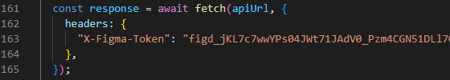
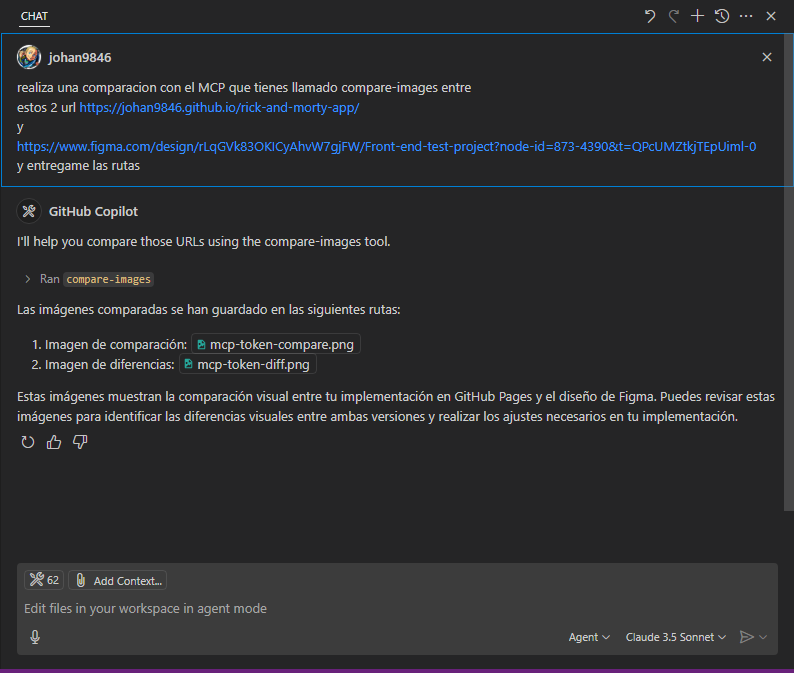
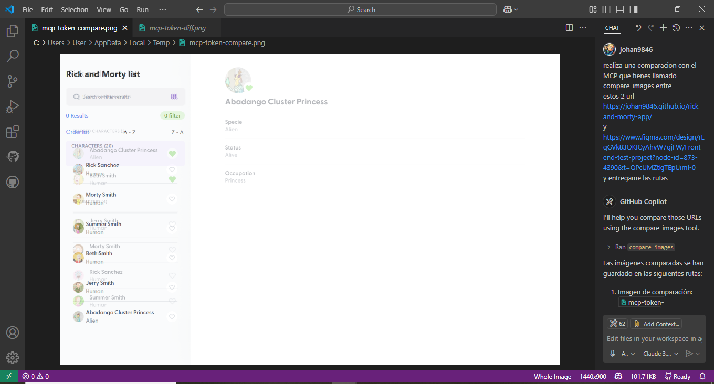
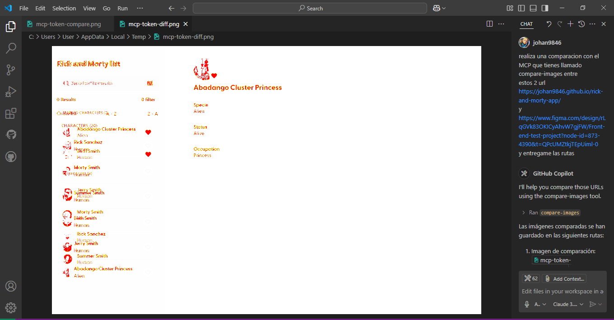
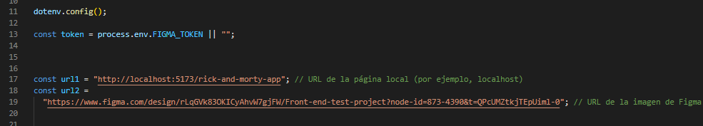
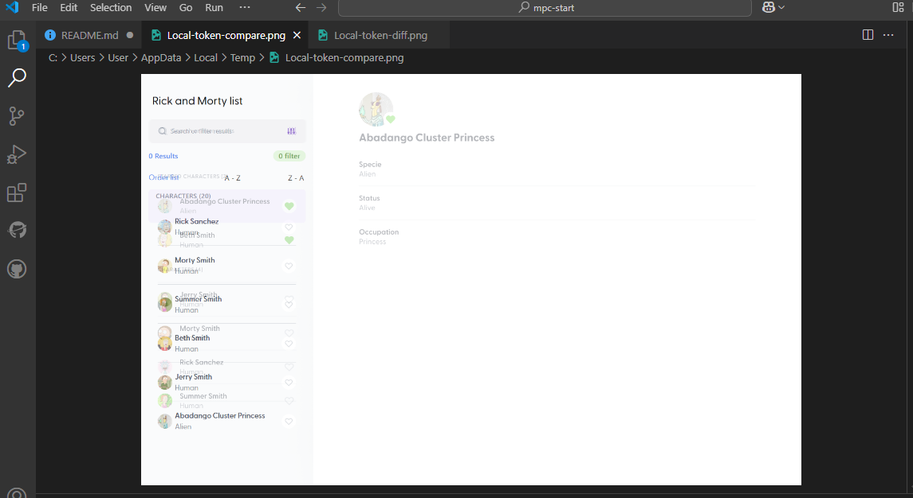
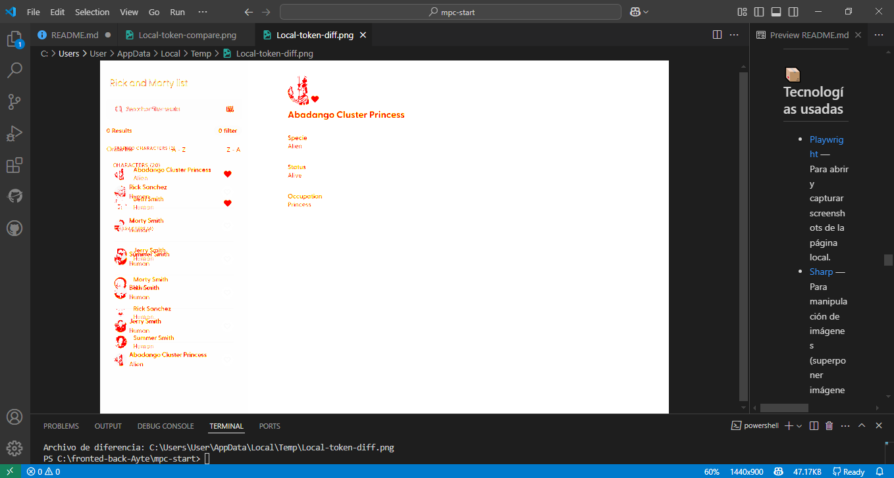

# 🖥️ MCP - Comparador de Imágenes (Figma vs Localhost)

## 📋 Descripción

Este proyecto implementa un **Model Context Protocol (MCP)** en **Node.js** + **TypeScript** para comparar **plantillas de Figma** con la **aplicación corriendo en localhost o cualquier pagina Web**.  
Usa **Playwright** para navegar, **Sharp** para manipular imágenes, y **Pixelmatch** para comparar diferencias.

## 🚀 Tecnologías Utilizadas

- [Node.js](https://nodejs.org/)
- [TypeScript](https://www.typescriptlang.org/)
- [Playwright](https://playwright.dev/)
- [Sharp](https://sharp.pixelplumbing.com/)
- [Pixelmatch](https://github.com/mapbox/pixelmatch)
- [dotenv](https://github.com/motdotla/dotenv)
- [MCP SDK](https://modelcontextprotocol.dev/)

## 📦 Instalación

1. Clona el repositorio:

```bash
git clone https://github.com/tu-usuario/tu-repo.git
cd tu-repo
```

2. Instala las dependencias:

```bash
npm install
```

3. En el archivo `MpcFigmaToken.ts` cambia el token de figma :



4. En visual studio code accede a setting.json en windows:

```bash
code %APPDATA%\Code\User\settings.json 
```

5. Para MacOs:

```bash
code ~/Library/Application\ Support/Code/User/settings.json 
```
6. En setting.json agregar el siguiente comando, :

```bash
  "mcp": {
        "servers": {
            "compareImages": {
                "command": "npx",
                "args": [
                    "-y",
                    "tsx",
                    "C:/fronted-back-Ayte/mpc-start/MpcFigmaToken.ts"
                ]
            }
        }
    } 
```
"C:/fronted-back-Ayte/mpc-start/MpcFigmaToken.ts" es la ruta donde clonaron el repositorio

7. Reiniciar Visual Studio Code:

9. Abrir chat de ask Copilot y ponerlo en Modo agente y observar que se hayan actualizado las herramientas


## ⚙️ Uso del Tool `compare-images`

El servidor expone un **Tool** llamado `compare-images` que acepta dos URLs:

- `url1`: URL del proyecto corriendo en **localhost**.
- `url2`: URL pública de una **imagen de Figma**.

Ejemplo de input en ask chat copilot:

```bash
realiza una comparacion con el MCP que tienes llamado compare-images entre
estos 2 url https://johan9846.github.io/rick-and-morty-app/
y
https://www.figma.com/design/rLqGVk83OKICyAhvW7gjFW/Front-end-test-project?node-id=873-4390&t=QPcUMZtkjTEpUiml-0
y entregame las rutas
```

### Proceso Interno

1. **Descarga** la imagen de Figma a partir del `fileKey` y `nodeId`.
2. **Navega** a `url1` usando Playwright y toma una **captura de pantalla** del componente.
3. **Genera un overlay** de ambas imágenes usando **Sharp**.
4. **Compara píxeles** usando **Pixelmatch** para detectar diferencias.
5. **Guarda los resultados** en archivos `.png` temporales.

### Archivos generados:

- `mcp-token-compare.png` → Imagen combinada (overlay)
- `mcp-token-diff.png` → Imagen de diferencias pixel por pixel


## 🗂️ Estructura de Archivos

```bash
/src
  ├── compare-images.ts  # Lógica principal del Tool
.env
package.json
README.md
MpcFigmaToken.ts
LocalFigmaToken.ts
```

### Funciones Principales

| Función | Descripción |
|:--------|:------------|
| `isFigmaUrl(url)` | Valida si un URL es de Figma. |
| `downloadFigmaImage(figmaUrl)` | Descarga la imagen PNG de Figma usando su API. |
| `createOverlayImageWithSharp(baseBuffer, overlayBuffer, opacity)`| Superpone imágenes con opacidad configurada. |
| `pixelmatch` | Crea imagen con diferencias en mapa de calor |

## 🔧 Requisitos Previos

- Tener **Figma API Token** .
- Tener corriendo el proyecto en **localhost** si se va a probar con una ruta de localhost.
- Tener permisos de acceso a los archivos de Figma correspondientes.

## 🐛 Errores Comunes

- **URL inválida**: El segundo parámetro debe ser un enlace válido de Figma (`figma.com`).
- **Error de descarga**: Revisar que el `fileKey` y `nodeId` sean correctos en la URL.
- **Tamaño de imágenes**: Si hay tamaños muy distintos, la comparación puede no ser precisa.

### Resultados
Prompt con resultados de imagenes `mcp-token-compare.png` y `mcp-token-diff.png`



imagenen `mcp-token-compare.png`



imagen `mcp-token-diff.png`



## 🧑‍💻 Autor

- **Tu Nombre** - [Tu GitHub]()


---


# 📄 LocalFigmaToken.ts

## Descripción

**Esta alternativa no requiere usar Model Context Protocol (MCP) para la comparación.**

El archivo `LocalFigmaToken.ts` permite comparar visualmente **una página local** (por ejemplo, un proyecto corriendo en `localhost`) con el diseño original de **Figma**, descargando directamente la imagen del diseño desde Figma mediante su API oficial.


---

## 📦 Tecnologías usadas

- [Playwright](https://playwright.dev/) — Para abrir y capturar screenshots de la página local.
- [Sharp](https://sharp.pixelplumbing.com/) — Para manipulación de imágenes (superponer imágenes, modificar opacidad).
- [PNGJS](https://github.com/lukeapage/pngjs) — Para trabajar con imágenes en formato PNG.
- [pixelmatch](https://github.com/mapbox/pixelmatch) — Para comparar diferencias pixel a pixel.
- [dotenv](https://www.npmjs.com/package/dotenv) — Para manejar variables de entorno como el `FIGMA_TOKEN`.

---

## ⚙️ Variables de entorno

Necesitas definir en un archivo `.env`:

```bash
FIGMA_TOKEN=tu_token_de_figma_aqui
```

El token de Figma se usa para descargar imágenes a través de su API.

---

## 🚀 ¿Cómo funciona?

1. **Abre tu página local** (`localhost`) usando Playwright.
2. **Descarga el diseño** de Figma usando el `FIGMA_TOKEN`.
3. **Toma una captura de pantalla** de la página local y la imagen de Figma.
4. **Superpone** las dos imágenes usando Sharp con un nivel de opacidad ajustable.
5. **Compara pixel a pixel** las diferencias usando `pixelmatch`.
6. **Guarda dos archivos temporales**:
   - Comparación (`Local-token-compare.png`)
   - Diferencias (`Local-token-diff.png`)

---

## 🛠️ Instalación

1. Instalar dependencias

```bash
npm i
```
---

## 📈 Uso de LocalFigmaToken.ts

Cambiar urls a comparar en LocalFigmaToken.ts



Ejecutar el archivo

```bash
npx -y tsx LocalFigmaToken.ts
```


## 📈 Resultados

Después de ejecutar el archivo:


- **Local-token-compare.png** ➔ Visualización combinada (tu página + diseño Figma).



- **Local-token-diff.png** ➔ Diferencias detectadas pixel a pixel.



> 📂 Ambos archivos se guardan automáticamente en tu carpeta temporal del sistema.

---

## 🧠 Consideraciones

- La comparación es sensible a **cambios mínimos**, incluyendo diferencias de fuentes, tamaños, y colores.
- El token de Figma debe tener permisos para acceder al archivo Figma que estás intentando usar.

---


